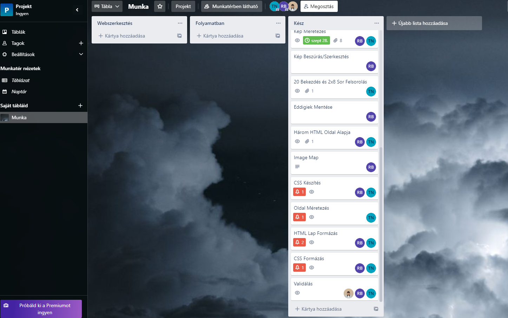

## Moszkva Projekt Munka

- Témakör választás
- Kép keresés,méretezés, beszúrás, szerkesztés
- Három HTML oldal
- Image Map
- CSS Formázás
- Validálás

Moszkvát a legenda szerint I. György kijevi nagyfejedelem alapította, az első írásos emlékek a városról 1147-ből származnak. A 18. és 19. században polgári város volt, a Szovjetunió idején pedig munkásvárossá vált. A városnak tíz közigazgatási körzete és 123 kerülete van. 2009-ben a világ harmadik leggazdagabb városa volt az itt élő milliárdosok számát tekintve,[2] emellett többször volt a világ legdrágább városa.[3] Világviszonylatban is óriásinak számító terei és utcái (melyek közül a leghíresebb a Vörös tér), hatalmas épületei (mint például a Kreml együttese, a Boldog Vazul- és a Megváltó Krisztus-székesegyház vagy a Hét nővér-felhőkarcolók) és rendkívül kiterjedt metróhálózatának állomásai világhírűek. A városkép nagyon sokszínű, ugyanis a cári és a szovjet idők monumentális emlékei mellett megtalálhatók a modern kor épületei is: Európa legmagasabb felhőkarcolói közül sok Moszkvában található.

[Wikipédia](http://hu.wikipedia.org/wiki/Moszkva "Wikipédia")
